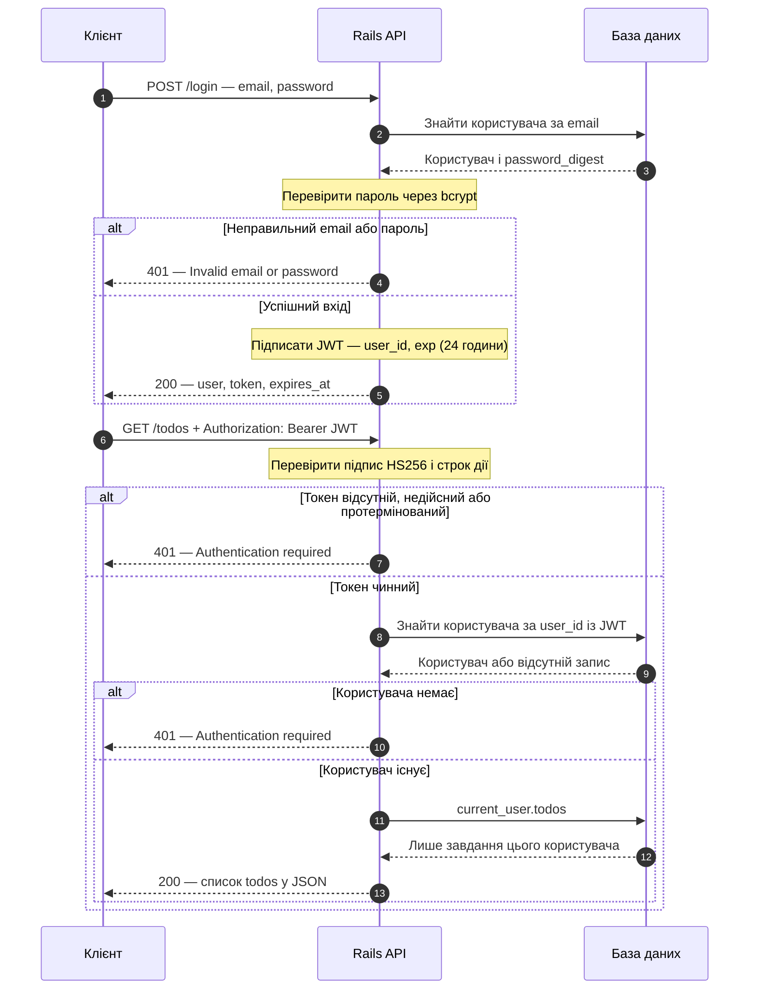

# Todo API

Rails 8.1.4 API with SQLite, tested with Ruby 4.0.6.

## Run locally

```sh
bundle install
bin/rails db:prepare
bin/rails server
```

## Як працює вхід через JWT

1. **Реєстрація:** `POST /register` приймає ім’я, email і пароль. Rails перевіряє дані, зберігає bcrypt-хеш пароля та одразу повертає JWT. Відкритий пароль не зберігається.
2. **Вхід:** `POST /login` приймає email і пароль. `User.authenticate_by` перевіряє їх через bcrypt. Неправильні дані повертають `401`.
3. **Видача токена:** після успішного входу сервер повертає `user`, `token` і `expires_at`. JWT містить `user_id` та `exp`, підписаний алгоритмом HS256 і діє 24 години. JWT підписаний, а не зашифрований: пароля в ньому немає.
4. **Доступ до todos:** клієнт передає `Authorization: Bearer <token>`. Сервер перевіряє підпис, строк дії та наявність користувача, після чого встановлює `current_user`.
5. **Власні завдання:** `current_user.todos` повертає лише завдання цього користувача. Створення автоматично призначає власника; доступ до чужого завдання повертає `404`.
6. **Вихід:** клієнт видаляє токен. Серверного `/logout` немає; копія токена залишається чинною до завершення строку дії. Після завершення 24 годин потрібно ввійти знову.

### Схема входу та запиту завдань



## Authentication

Register with a name, email and password (at least 8 characters):

```sh
curl -X POST http://localhost:3000/register \
  -H 'Content-Type: application/json' \
  -d '{"user":{"name":"Example","email":"me@example.com","password":"my-long-password"}}'
```

Log in with an existing account:

```sh
curl -X POST http://localhost:3000/login \
  -H 'Content-Type: application/json' \
  -d '{"user":{"email":"me@example.com","password":"my-long-password"}}'
```

Both return `{ "user": { "id": 1, "name": "Example", "email": "me@example.com" }, "token": "...", "expires_at": "..." }`.
Pass the token in the `Authorization: Bearer <token>` header. JWTs expire after 24 hours; log in again to get a new token. Passwords are hashed with bcrypt. JWTs contain only `user_id` and `exp` and are signed with HS256 using a key derived from Rails `secret_key_base`. The server verifies the signature and expiration before looking up the user; tokens are not stored in the database. Use HTTPS when deploying.

| Method | Path | Action |
| --- | --- | --- |
| POST | /register | Create account and JWT (201) |
| POST | /login | Issue JWT (200) |
| GET | /me | Current user's id, name and email |
| GET | /todos | List current user's todos |
| GET | /todos/:id | Retrieve own todo |
| POST | /todos | Create own todo (201) |
| PATCH | /todos/:id | Update own todo |
| PATCH | /todos/:id/complete | Mark own todo completed |
| DELETE | /todos/:id | Delete own todo (204) |

All endpoints except registration and login require authentication (`/up` remains a public health check). Missing, invalid, or expired tokens return 401. Invalid credentials also return 401. Validation errors return 422; missing or other users' todos return 404.

```sh
export TOKEN='paste-token-from-login'
curl http://localhost:3000/me -H "Authorization: Bearer $TOKEN"
curl -X POST http://localhost:3000/todos \
  -H "Authorization: Bearer $TOKEN" -H 'Content-Type: application/json' \
  -d '{"todo":{"title":"Buy milk"}}'
curl http://localhost:3000/todos -H "Authorization: Bearer $TOKEN"
curl -X PATCH http://localhost:3000/todos/1/complete -H "Authorization: Bearer $TOKEN"
```

Todo requires a title and belongs to a user. Description is optional; completed defaults to false and cannot be null. Ownership comes exclusively from the authenticated user; client-supplied `user_id` is ignored on create and update. Deleting a user with todos is blocked.

## Logout and migration from sessions

Logout happens on the client: delete the saved token. There is no `/logout` endpoint or server-side revocation in this simple implementation. A copied JWT remains valid until expiration, including after a password change. No refresh tokens are used.

The old `sessions` table is retained to preserve existing data and migration history, but the application no longer reads or writes it. Old session tokens no longer work; log in again to obtain a JWT. Existing users and todos are preserved.

JWT implementation uses [ruby-jwt](https://github.com/jwt/ruby-jwt).

## Existing accounts

The migration preserves existing users and todos. Existing accounts have no password and cannot log in until you set one through a trusted Rails console:

```ruby
user = User.find_by!(email: "default@example.com")
user.update!(password: "choose-a-new-private-password")
```

Seeds only create a default development account when `SEED_USER_PASSWORD` is supplied, and never overwrite existing accounts. There is no public password reset flow yet.

## Verify

```sh
bin/rails test
bin/rubocop
```
